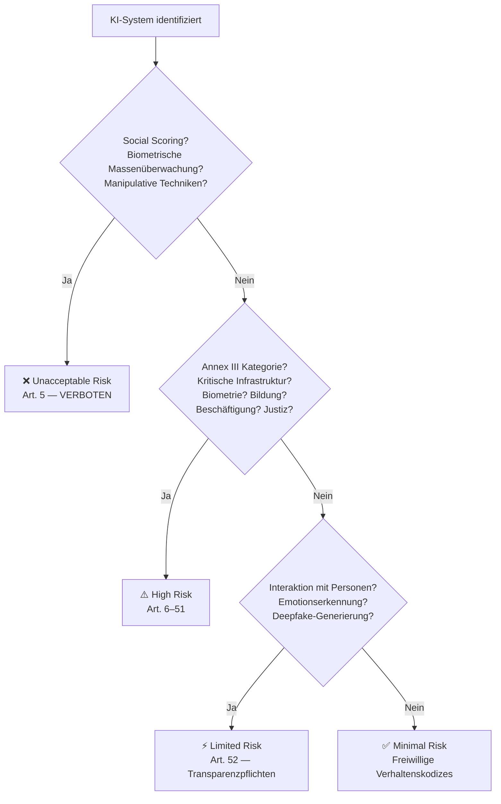

<!-- SPDX-License-Identifier: CC-BY-4.0 -->
<!-- Copyright (c) 2024-2026 Robert Alexander Massinger -->

# EU AI Act — Compliance Checkliste

> Praxisorientierte Checkliste zur Einordnung und Umsetzung der
> EU-KI-Verordnung (AI Act, Verordnung (EU) 2024/1689) für
> Software-Projekte mit KI-Komponenten.

| Feld     | Wert                 |
|----------|----------------------|
| Version  | 1.0                  |
| Stand    | 2026-03              |
| Lizenz   | CC-BY 4.0            |
| Autor    | EthosAI Architecture |

---

## 1  Risikoklassifikation — Entscheidungsbaum

---

## 2  Minimal Risk — Empfohlene Maßnahmen

KI-Systeme ohne spezifisches Risiko. Keine gesetzlichen Pflichten,
aber empfohlen:

- [ ] Verhaltenskodex gemäß Art. 69 erstellt
- [ ] Dokumentation der KI-Komponenten (Modelle, Datenquellen)
- [ ] Regelmäßige Qualitätsprüfung der KI-Ausgaben
- [ ] Transparenz-Hinweis für Endnutzer (freiwillig)
- [ ] Logging für Nachvollziehbarkeit

---

## 3  Limited Risk — Transparenzpflichten (Art. 52)

| Pflicht | Checkliste |
|---------|------------|
| **Art. 52(1)** — Chatbot-Hinweis | [ ] Nutzer wissen, dass sie mit KI interagieren |
| **Art. 52(2)** — Emotionserkennung | [ ] Nutzer über Emotionserkennung informiert |
| **Art. 52(3)** — Deepfakes | [ ] Synthetische Inhalte als solche gekennzeichnet |
| **Art. 52(4)** — KI-generierter Text | [ ] Bei öffentlichem Interesse: Kennzeichnungspflicht |

### Umsetzungs-Tipps

1. **UI-Banner:** „Diese Antwort wurde von einer KI generiert."
2. **Metadata:** KI-generierte Inhalte mit `ai_generated: true` taggen.
3. **Audit-Log:** Alle KI-Interaktionen nachvollziehbar protokollieren.

---

## 4  High-Risk — Vollständige Anforderungsliste

Gilt für KI-Systeme nach Annex III (z.B. kritische Infrastruktur,
Bildung, Beschäftigung, Strafverfolgung).

### 4.1  Risikomanagement (Art. 9)

- [ ] Risikomanagementsystem etabliert und dokumentiert
- [ ] Risiken identifiziert, bewertet und priorisiert
- [ ] Geeignete Maßnahmen zur Risikominimierung umgesetzt
- [ ] Restrisiken dokumentiert und akzeptiert
- [ ] Regelmäßige Überprüfung des Risikomanagementsystems

### 4.2  Daten-Governance (Art. 10)

- [ ] Trainingsdaten dokumentiert (Herkunft, Umfang, Qualität)
- [ ] Bias-Prüfung durchgeführt
- [ ] Datenqualitätskriterien definiert und eingehalten
- [ ] Repräsentativität der Daten sichergestellt
- [ ] Datenschutzkonformität geprüft (→ DSGVO)

### 4.3  Technische Dokumentation (Art. 11)

- [ ] Allgemeine Beschreibung des KI-Systems
- [ ] Entwicklungsmethodik dokumentiert
- [ ] Design-Entscheidungen nachvollziehbar
- [ ] Modellarchitektur beschrieben
- [ ] Leistungsmetriken definiert und gemessen

### 4.4  Protokollierung (Art. 12)

- [ ] Automatische Logging-Fähigkeit implementiert
- [ ] Logs enthalten: Zeitstempel, Input, Output, Entscheidungspfad
- [ ] Aufbewahrungsdauer festgelegt
- [ ] Logs vor Manipulation geschützt

### 4.5  Transparenz (Art. 13)

- [ ] Gebrauchsanweisung für Betreiber erstellt
- [ ] Leistungsgrenzen dokumentiert
- [ ] Vorgesehener Verwendungszweck beschrieben
- [ ] Risiken und Einschränkungen kommuniziert

### 4.6  Menschliche Aufsicht (Art. 14)

- [ ] Menschliche Kontrolle vorgesehen und implementiert
- [ ] Fähigkeit zum Eingreifen und Übersteuern
- [ ] Mechanismus zum Stoppen des Systems
- [ ] Qualifikationsanforderungen an Aufsichtspersonen definiert

### 4.7  Genauigkeit, Robustheit, Cybersicherheit (Art. 15)

- [ ] Genauigkeitsmetriken definiert und gemessen
- [ ] Robustheit gegen Fehler und Angriffe geprüft
- [ ] Cybersicherheitsmaßnahmen implementiert
- [ ] Redundanz- und Failback-Mechanismen vorhanden

---

## 5  Unacceptable Risk — Verbotene Praktiken (Art. 5)

Die folgenden KI-Anwendungen sind **verboten**:

| # | Verbotene Praxis | Beschreibung |
|---|------------------|-------------|
| 1 | Social Scoring | Bewertung natürlicher Personen über Zeiträume hinweg |
| 2 | Ausnutzung von Schwächen | KI, die Alter, Behinderung oder soziale Lage ausnutzt |
| 3 | Unterschwellige Manipulation | Techniken, die das Verhalten unterschwellig beeinflussen |
| 4 | Biometrische Echtzeit-Fernidentifizierung | In öffentlichen Räumen (außer enge Ausnahmen) |
| 5 | Emotionserkennung am Arbeitsplatz | In Beschäftigung und Bildung (mit Ausnahmen) |
| 6 | Biometrische Kategorisierung | Nach sensiblen Merkmalen (Rasse, Religion, etc.) |
| 7 | Gesichtserkennung aus Internet-Scraping | Aufbau von Datenbanken durch ungezieltes Scraping |

---

## 6  Wie EthosAI Compliance adressiert

EthosAI implementiert EU AI Act Compliance als integrierten
Bestandteil der Plattform:

| Anforderung | EthosAI-Lösung |
|-------------|----------------|
| Risikoklassifikation | Integriertes 4-Stufen-Sicherheitsmodell (SEC-Tier 0–3) |
| Daten-Governance | Datenklassifikation (PUBLIC → CONFIDENTIAL) mit Enforcement |
| Protokollierung | Automatisches Audit-Logging aller KI-Interaktionen |
| Transparenz | KI-Antworten als solche gekennzeichnet, Entscheidungspfade nachvollziehbar |
| Menschliche Aufsicht | Human-in-the-Loop für kritische Entscheidungen |
| Cybersicherheit | Rollenbasierte Zugriffskontrolle, JWT-Authentifizierung |

---

## Über EthosAI

EthosAI® implementiert EU AI Act Compliance und DSGVO-Konformität
als integrierten Bestandteil der Plattform — nicht als
nachträgliche Prüfung.

→ [Mehr erfahren](https://ethos-ai.eu)
→ [World-SDK für Entwickler](https://github.com/Rob9999/ethos-ai-world-sdk)
→ [DSGVO LLM-Provider Guide](gdpr-llm-provider-guide.md)
→ [Security Tier Model](security-tier-model.md)
→ [LLM-Provider-Analyse](llm-provider-analysis.md)

---

*Dieses Dokument wird unter CC-BY 4.0 veröffentlicht und regelmäßig aktualisiert.*
