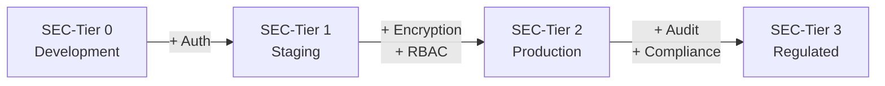
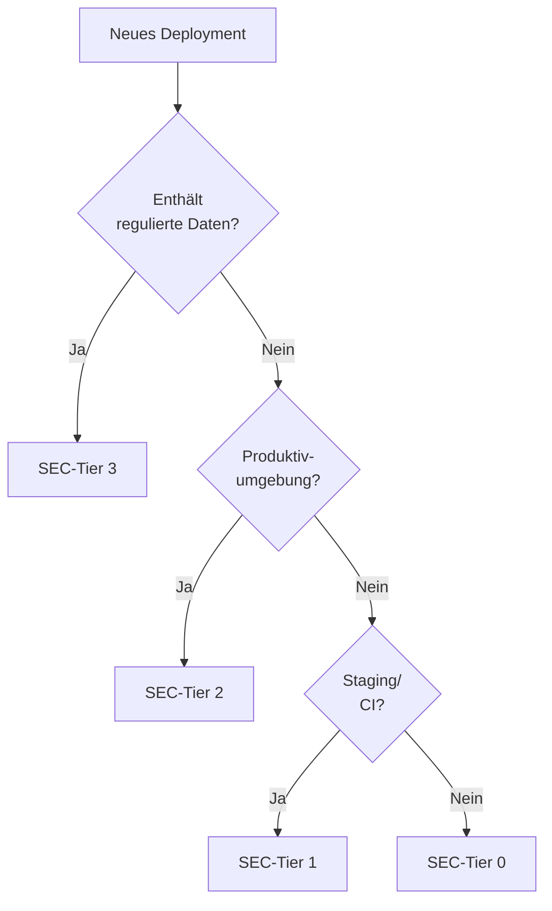

<!-- SPDX-License-Identifier: CC-BY-4.0 -->
<!-- Copyright (c) 2024-2026 Robert Alexander Massinger -->

# EthosAI Security Tier Model

> Öffentliche Dokumentation des EthosAI-Sicherheitsstufenmodells
> (SEC-Tier 0–3) zur Transparenz gegenüber Nutzern, Auditoren
> und Partnern.

| Feld     | Wert                 |
|----------|----------------------|
| Version  | 1.0                  |
| Stand    | 2026-03              |
| Lizenz   | CC-BY 4.0            |
| Autor    | EthosAI Architecture |

---

## 1  Übersicht

EthosAI verwendet ein vierstufiges Sicherheitsmodell (SEC-Tier), das
Authentifizierung, Autorisierung, Datenverschlüsselung und
Audit-Logging pro Betriebsumgebung regelt.

---

## 2  SEC-Tier 0 — Development

| Eigenschaft | Wert |
|-------------|------|
| Umgebung | Lokale Entwicklung, Demos |
| Authentifizierung | Optional (--no-auth) |
| Autorisierung | Keine Rollentrennung |
| Verschlüsselung | TLS optional |
| Logging | Console-Logging |
| Datenklassifikation | Nur PUBLIC-Daten |

### Richtlinien
- Verwendung **nur** für lokale Entwicklung und Demos
- Keine personenbezogenen oder vertraulichen Daten
- Kein Zugriff von externen Netzwerken

---

## 3  SEC-Tier 1 — Staging

| Eigenschaft | Wert |
|-------------|------|
| Umgebung | Testserver, CI/CD |
| Authentifizierung | API-Key oder JWT |
| Autorisierung | Basis-Rollen (admin, user) |
| Verschlüsselung | TLS 1.2+ erforderlich |
| Logging | Strukturiertes Logging (JSON) |
| Datenklassifikation | PUBLIC + INTERNAL |

### Richtlinien
- Authentifizierung immer aktiv
- Testdaten statt Echtdaten verwenden
- Zugriff auf bekannte IPs beschränken
- Logs regelmäßig rotieren

---

## 4  SEC-Tier 2 — Production

| Eigenschaft | Wert |
|-------------|------|
| Umgebung | Produktivsysteme |
| Authentifizierung | JWT mit kurzer Lebensdauer |
| Autorisierung | RBAC mit Least-Privilege |
| Verschlüsselung | TLS 1.3, at-rest AES-256 |
| Logging | Zentrales SIEM-fähiges Logging |
| Datenklassifikation | PUBLIC + INTERNAL + CONFIDENTIAL |

### Richtlinien
- Multi-Factor Authentication für Admin-Zugang
- Gehärtete Container-Images (distroless/minimale Basis)
- Netzwerksegmentierung zwischen Komponenten
- Regelmäßige Vulnerability-Scans
- Backup & Disaster-Recovery dokumentiert
- Incident-Response-Plan vorhanden

### Compliance-Anforderungen
- ISO 27001 Controls anwendbar
- DSGVO Art. 32 (technische & organisatorische Maßnahmen)
- SOC 2 Type II — Verfügbarkeit & Vertraulichkeit

---

## 5  SEC-Tier 3 — Regulated

| Eigenschaft | Wert |
|-------------|------|
| Umgebung | Regulierte Branchen (Finanzen, Gesundheit, Behörden) |
| Authentifizierung | mTLS + JWT + MFA |
| Autorisierung | ABAC (Attribut-basiert) |
| Verschlüsselung | TLS 1.3, Hardware-Keystore (HSM) |
| Logging | Unveränderliches Audit-Log mit Zeitstempel |
| Datenklassifikation | Alle Stufen inkl. STRICTLY_CONFIDENTIAL |

### Richtlinien
- Alle SEC-Tier 2 Richtlinien gelten zusätzlich
- Hardware Security Module (HSM) für Schlüsselverwaltung
- Unveränderliche Audit-Logs (append-only, signiert)
- Regelmäßige Penetration Tests durch externen Dienstleister
- Automatische Anomalie-Erkennung
- Datenverarbeitung ausschließlich in EU/EWR
- Jährliche externe Sicherheitsaudits

### Compliance-Anforderungen
- Alle SEC-Tier 2 Anforderungen
- EU AI Act Art. 9 (Risk Management System)
- EU AI Act Art. 15 (Accuracy, Robustness, Cybersecurity)
- DSGVO Art. 35 (Datenschutz-Folgenabschätzung)
- Branchenspezifisch: BaFin (Finanzen), DiGA (Gesundheit)

---

## 6  Tier-Zuordnung

---

## 7  Zusammenfassung der Sicherheitsmaßnahmen

| Maßnahme | Tier 0 | Tier 1 | Tier 2 | Tier 3 |
|----------|--------|--------|--------|--------|
| Authentifizierung | Optional | API-Key/JWT | JWT (short-lived) | mTLS+JWT+MFA |
| Autorisierung | — | Basis-Rollen | RBAC | ABAC |
| TLS | Optional | 1.2+ | 1.3 | 1.3 + HSM |
| At-rest Encryption | — | — | AES-256 | AES-256 + HSM |
| Audit-Logging | Console | JSON | SIEM | Immutable |
| Vulnerability Scans | — | — | Regelmäßig | Kontinuierlich |
| Penetration Tests | — | — | Empfohlen | Pflicht (extern) |
| DSGVO-Konformität | — | Basis | Art. 32 | Art. 32+35 |
| EU AI Act | — | — | Empfohlen | Art. 9+15 |

---

## Über EthosAI

EthosAI® integriert Security-by-Design in jede Plattformschicht —
von der Entwicklungsumgebung bis zum regulierten Produktivbetrieb.

→ [Mehr erfahren](https://ethos-ai.eu)
→ [EU AI Act Compliance](eu-ai-act-compliance-checklist.md)
→ [DSGVO LLM-Provider Guide](gdpr-llm-provider-guide.md)

---

*Dieses Dokument wird unter CC-BY 4.0 veröffentlicht und regelmäßig aktualisiert.*
